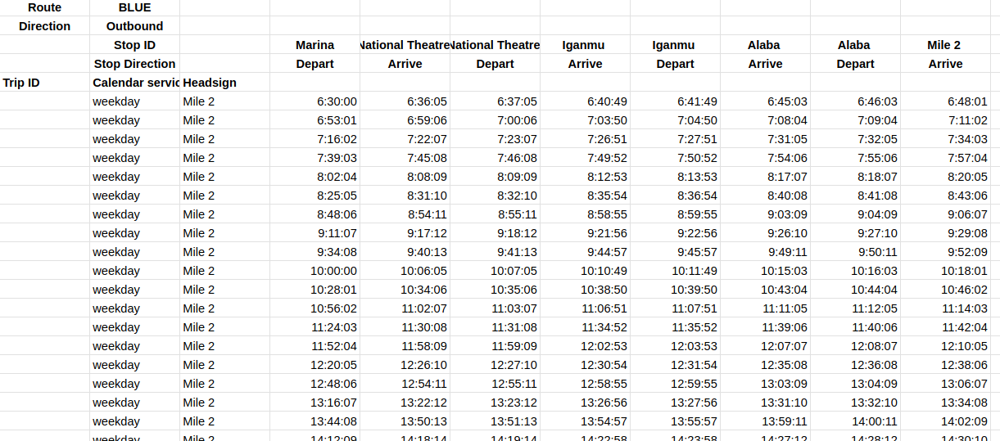
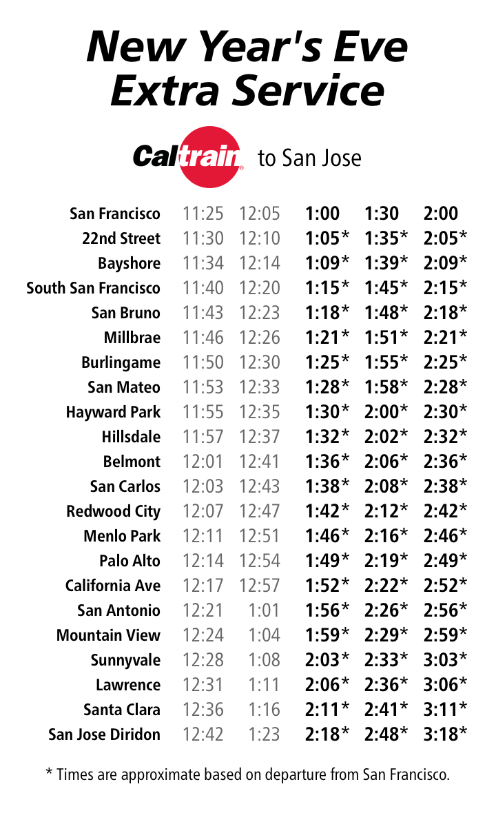

# Unofficial Caltrain GTFS feed for 2026-01-01

[Download GTFS feed (zip)](https://lagos-transit.github.io/lagos-gtfs/gtfs.zip)

## How the feed is made

* The original GTFS feed was downloaded from `https://api.511.org/transit/datafeeds?api_key=[API KEY]&operator_id=CT` and slightly adjusted
* The timetables are manually slightly modified to get them into a form like this, which is saved in the spreadsheet `input-data/NYE timetables.xlsx`:

* `scripts/run.sh`, which uses `scripts/timetable-to-gtfs.py`, will generate the GTFS timetables

## Source data

Unofficial timetable

